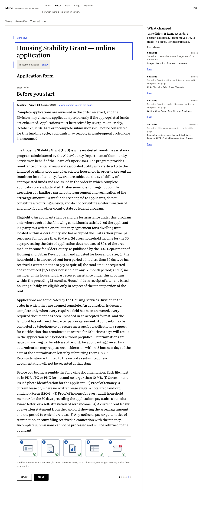

# Mine · 由我

**The web shouldn't decide how you have to use it.** Mine turns a page into the edition that fits the person reading it — and shows exactly what it changed.

*Mine is a prototype exploring interface sovereignty: the idea that people should be able to shape software around their needs instead of continually shaping themselves around software.*



## Three freedoms, one page

1. **Freedom to shape.** Presets (Focus · Plain · Large) and *My words* reorganise the page: set aside, group, enlarge, plain words, one thing at a time.
2. **Freedom to see your choices.** The engine surfaces every decision the page asks for, labels which are optional, and notes what was pre-checked.
3. **Freedom to change your mind.** The original is one gesture away. Every change is listed and reversible. Nothing is auto-decided.

What it is not: an accessibility overlay (those work for the site owner; this runs on the reader's side and logs every change), a reader mode (that adapts reading; this adapts *doing*: forms, decisions, deadlines), or a browser agent (delegation is not autonomy).

## How it works

```
content schema  →  engine  →  edition
  (blocks with        (pure, deterministic,      (rendered view or steps)
   importance,         rules 1–9)
   kind, group)             ↓
                        changes  →  colophon (every number is computed from the change list)
```

- `src/engine/schema.ts` — the block model (`critical` blocks can never be hidden) and the preference object, mirrored in Zod.
- `src/engine/transform.ts` — `transform(content, prefs)` applies nine ordered rules (media, density, navigation, deadline, reading level, terms, scale, decisions, steps) and records a `Change` with a human reason for each.
- `src/engine/fallback.ts` — the offline interpreter for *My words*: phrase groups → preferences + reasons, in English and Chinese.
- `api/interpret.ts` — the only live model call (one OpenAI-compatible chat completion, JSON mode, 8 s deadline, one retry, Zod-validated, falls back offline). The source of every interpretation is shown in the UI.
- `src/ui/` — the portal (as published) and the edition, sharing one morph; the colophon rail; hold-to-compare; back to original.

## Run locally

```bash
npm install
npm run dev        # http://localhost:5173 (serves /api/interpret too)
npm run demo       # production build + preview on http://localhost:4173, all offline
```

Add `?demo=1` for the stage keys: `1` portal · `2` Focus · `3` My words (example prefilled) · `4` apply · `5` hold-to-compare · `6` ending · `r` reset. `?lang=en|zh` picks the language; the header toggles it.


## The extension (in place, on real pages)

`extension/` is the same engine on the page you are actually on: a Chromium extension that reads a page into blocks, applies your edition in place (the real form stays the real form), lists every change in a panel and undoes all of it on request. Build with `npm run ext:build`, load `extension/.output/chrome-mv3` unpacked. See [extension/README.md](extension/README.md).

## Environment

Optional. Without a key, *My words* uses the offline interpreter and says so.

```
LLM_BASE_URL=https://api.deepseek.com
LLM_MODEL=deepseek-chat
LLM_API_KEY=
```

Any OpenAI-compatible endpoint works. The key never reaches the client.

## Tests

```bash
npm run check      # typecheck + lint + unit tests + build
npm test           # vitest: engine invariants I1–I8, fallback phrase groups, content validation, interpreter
NODE_PATH=<a node_modules with playwright> node tools/accept.cjs http://localhost:4173   # browser acceptance: axe, console, 360 px, storyline
```

Invariants the engine is tested against: every critical block is present in every mode (and in 50 random preference combinations); every required field appears exactly once; a rewritten passage keeps every digit sequence of the original; Default produces zero changes; one-at-a-time contains every field and decision exactly once; `preChecked` is never altered; same input, identical output; every summary number equals the count derived from the change list.

## Accessibility principles

Landmarks, one `h1`, a skip link; every control keyboard-reachable with a 3 px focus ring; hold-to-compare is a toggle on the keyboard; targets ≥ 44 px (≥ 48 px in Large); `aria-live` announces the summary after each transform and focus moves to the page heading; term popovers are buttons with `aria-expanded`, nothing is hover-only; `prefers-reduced-motion` respected everywhere including the landing autoplay; works at 360 px; axe reports zero serious or critical issues on every screen — including the portal, so the line "it passes the automated checks" is true.

Presets are described by need, never by diagnosis. The interpreter is instructed never to infer or mention a condition.

## Limitations

- The demo pages are described in our block schema, not extracted from the live web.
- Plain-language text is generated at build time and checked by a human; nothing is rewritten live.
- This is not a compliance tool and claims no compliance for anyone.
- User testing so far: none.

## Roadmap

- A browser extension that extracts blocks from a real DOM (readability heuristics + form detection + a model classifier), held to the same invariants.
- A portable preference passport.
- Per-site memory.
- A second content type (checkout, medical intake).

## Licence

MIT. Literata and Atkinson Hyperlegible are self-hosted under their own licences (OFL).
